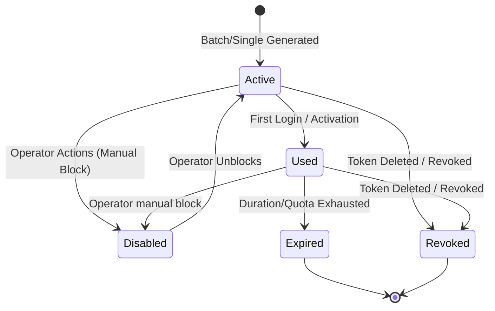

# CafePulse Architecture Revision: Internet Access Management & Terminology Refactor

This document presents a comprehensive technical design and implementation plan to overhaul the user experience, terminology, and system architecture of CafePulse. The primary objective is to make the application highly approachable for laypeople (small business owners, café managers, home users) while retaining full technical depth, clarity, and precise controls for network technicians.

---

## Goal Description
CafePulse has evolved from a simple network monitor into a multi-workspace MikroTik Operations Platform. To align with this growth and prevent user confusion, we are overhauling the terminology, feature grouping, and module architectures. 

This revision transitions CafePulse from raw, network-centric jargon to **workflow-driven, user-friendly paradigms**. Most notably, the *Voucher Generator* will be evolved into an **Internet Access Management (IAM)** suite, the *Home WiFi Monitor* will be renamed to **Personal Network Discovery** with clear platform disclosures, and a new **Access Package Engine** will govern both commercial and guest access.

---

## User Review Required

> [!IMPORTANT]
> **Key Decisions Needing Your Approval:**
>
> 1. **Home WiFi Rename to "Personal Network Discovery":** This avoids the false expectation that CafePulse can configure generic third-party domestic routers (e.g., TP-Link, Netgear) and highlights its role as a plug-and-play local discovery tool.
> 2. **Introduction of "Internet Access Management" (IAM):** This term is adopted as the overarching module under **Operations**, unifying Voucher Generation, Packages, Customer lists, and Guest WiFi.
> 3. **The Access Package Engine Paradigm:** Decoupling the "Voucher" (which acts as a temporary token) from the "Access Package" (which defines speed, quota, and duration).
> 4. **Dual-View Toggle (Basic vs. Advanced):** Allowing the user to toggle visual complexity per page rather than globally, accommodating both non-technical operators and advanced network engineers dynamically.

---

## Open Questions

> [!NOTE]
> **Technical Design Considerations for Discussion:**
> - *Customer Persistence:* Should Customer profiles be stored strictly locally in `cafepulse.db` (low friction, local-first) or should they map to RouterOS User Comments/User Manager databases to enable multi-workstation sync? *Proposed recommendation:* Keep customer profiles in the local SQLite database for maximum speed and simplicity, with a background sync mechanism that labels MikroTik hotspot users with a hash identifier (e.g., `CP_CUST_124`) in the comment field.
> - *VLAN Guest Segregation:* Should the Guest Access feature automatically attempt to create VLANs and DHCP servers on the MikroTik, or should it leverage the existing Hotspot configuration and simply provisions specialized profiles? *Proposed recommendation:* In basic mode, map it to the default Hotspot service using guest-specific profiles. In advanced mode, launch a 4-step wizard to configure a segregated guest bridge/VLAN.

---

## Proposed Changes

```
c:\Users\USER\Documents\Yubelki\CafePulse\CafePulse\
├── core/
│   └── iam/                        <-- [NEW] Backend engine for IAM operations
│       ├── __init__.py
│       ├── package_engine.py       <-- Package duration/quota calculator
│       ├── voucher_manager.py      <-- CRUD, generation and token lifecycle
│       └── customer_ledger.py      <-- SQLite customer profiles mapping
└── ui/widgets/
    ├── sidebar.py                  <-- [MODIFY] Updated workspaces and labels
    ├── personal_network_page.py    <-- [NEW] Renamed/refactored from home_wifi_page.py
    ├── compatibility_page.py       <-- [NEW] Supported platforms disclosure widget
    └── iam/                        <-- [NEW] Refactored IAM views (replacing hotspot_page.py)
        ├── __init__.py
        ├── iam_page.py             <-- Master IAM frame (tab switcher)
        ├── iam_dashboard.py        <-- Operations dashboard & quick statistics
        ├── iam_packages.py         <-- Access Package builder (CRUD)
        ├── iam_vouchers.py         <-- Token engine, CSV/PDF batch layouts
        ├── iam_customers.py        <-- Customer ledger and history cards
        └── iam_guests.py           <-- Frictionless temporary guest provisioner
```

---

## Detailed Execution Plan (The 12 Phases)

### Phase 1: Current Feature Matrix Table

Below is the audited feature matrix mapping CafePulse's existing capabilities, identifying technical dependencies, workspace targets, and risk of confusion:

| Feature Name | Technical Name (RouterOS) | Current Workspace | Recommended Workspace | RouterOS Dependency | Confusion Risk | Proposed Refactoring / Actions |
| :--- | :--- | :--- | :--- | :--- | :--- | :--- |
| **Home WiFi Monitor** | Local ARP Scan & Neighbors | NETWORK | NETWORK | **None** (Works on any LAN) | **HIGH** - Users expect domestic router settings config | Rename to **Personal Network Discovery**; add clear platform limitation notice. |
| **Device Manager** | IP/MAC/ARP / OUI Lookup | OPERATIONS | OPERATIONS | **None** (Local cache) | **Medium** - Mixed with router-dependent features | Keep under Operations, label as universal device discovery. |
| **Hotspot Manager** | `/ip hotspot` | OPERATIONS | OPERATIONS (as sub-view) | **Required** (MikroTik Hotspot) | **Medium** - Conflated with local portable hotspots | Deconstruct; commercial aspects move to **Internet Access Management**. |
| **Voucher Generator** | `/ip hotspot user` | OPERATIONS | OPERATIONS (inside IAM) | **Required** (MikroTik Hotspot) | **HIGH** - Too narrow; users expect just code printing | Evolve into **Internet Access Management (IAM)** suite. |
| **DHCP Lease Center** | `/ip dhcp-server lease` | OPERATIONS | NETWORK | **Required** (MikroTik DHCP) | **Low** - Fairly standard | Move to **Network Workspace** alongside IP configurations. |
| **Alert Center** | System log / Monitoring alerts | OPERATIONS | OPERATIONS | **Optional** (Local threshold limits) | **Low** | Keep under Operations; integrate with IAM usage alerts. |
| **Dashboard** | Router info / Health metrics | BUSINESS | BUSINESS | **Required** (MikroTik API) | **Low** | Retain; streamline layout for business-level KPIs. |
| **Analytics & BI (PRO)** | Traffic database & AI engine | BUSINESS | BUSINESS | **Required** (MikroTik API) | **Low** | Retain; add predictive analysis for IAM package usage. |
| **MikroTik Dashboard (6 Tabs)** | System/IP/DNS/VLAN/Recipe/Diag | NETWORK | NETWORK | **Required** (MikroTik API) | **Low** - Target is technicians | Retain; enforce strict Basic/Advanced toggle per tab. |

---

### Phase 2: Terminology Matrix

To make CafePulse highly approachable without losing expert-level precision, we establish a bilingual translation and structural mapping matrix:

| Category | User-Friendly (Indonesian) | User-Friendly (English) | Technical Name (RouterOS/API) | RouterOS API / CLI Path | Visual Representation in UI |
| :--- | :--- | :--- | :--- | :--- | :--- |
| **Module** | Manajemen Akses Internet | Internet Access Management | Hotspot & User Profile Manager | `/ip/hotspot` | Navigation Item (Operations) |
| **Voucher** | Voucher Akses / Token | Access Token / Voucher | Hotspot User | `/ip/hotspot/user` | Cards & printable grids |
| **User Hotspot** | Akun Pengguna / User | User Account | Hotspot User | `/ip/hotspot/user` | Tabular listings, customer cards |
| **Active Session** | Sesi Aktif / Status Online | Active Session | Active Host | `/ip/hotspot/active` | Real-time radar list & count badge |
| **Bandwidth Profile** | Paket Kecepatan | Speed Profile | User Profile / Rate Limit | `/ip/hotspot/user/profile` | Speedometers or simple tags (e.g. 5 Mbps) |
| **Limit Uptime** | Batas Waktu Aktif | Duration Limit | Uptime Limit | `/ip/hotspot/user` -> `limit-uptime` | Progress bars indicating remaining time |
| **Limit Bytes Total** | Batas Kuota Data | Quota Limit | Total Byte Limit | `/ip/hotspot/user` -> `limit-bytes-total`| Donut charts representing data spent |
| **DHCP Lease** | Sewa Alamat IP | IP Address Allocation | DHCP Lease | `/ip/dhcp-server/lease` | Connected devices grid with lease duration |
| **Queue / QoS** | Pembagian Bandwidth | Traffic Shaper | Simple Queue | `/queue/simple` | Dynamic bandwidth lines |

---

### Phase 3: Evaluate & Replace "Home WiFi"

#### Rename Options Evaluation

| Option | Approachable | Technical Clarity | False Expectation Risk | Final Verdict |
| :--- | :---: | :---: | :---: | :---: |
| **Jaringan Rumah** (Home WiFi) | Excellent | Poor | **Critical** (Implies control over cheap domestic routers) | **Rejected** |
| **Home Network Discovery** | Good | Moderate | High (Implies auto-setup) | **Rejected** |
| **Network Profiles** | Poor | Good | Low | **Rejected** (Too abstract) |
| **Personal Network Discovery** (Deteksi Jaringan Pribadi) | **Excellent** | **Excellent** | **None** (Clear focus is discovery, not management) | **RECOMMENDED** |

#### UX Design & Limitation Disclosure for Personal Network Discovery
1. **Title & Subtitle Update:**
   - Title: `Deteksi Jaringan Pribadi` / `Personal Network Discovery`
   - Subtitle: `"Deteksi perangkat jaringan lokal — plug & play, tanpa perlu konfigurasi router."`
2. **Prominent Universal Indicator:** A visual badge styled with a blue border indicating `Universal (Tanpa Router MikroTik)` to assure the user that this tool uses standard ARP scanning.
3. **Limitation Notice Re-design:** Move from a small text notice to an elegant card utilizing a subtle Warning HSL palette.
   > [!WARNING]
   > **Batasan Deteksi Mandiri (Universal Mode):**
   > Modul ini memindai jaringan menggunakan protokol ARP standar. Aplikasi **tidak dapat** membatasi kecepatan, memutus koneksi, atau mengaudit riwayat kunjungan tanpa adanya integrasi tingkat router.
   >
   > *Untuk kontrol bandwidth penuh, silakan beralih ke Mode MikroTik.*

---

### Phase 4: Voucher Generator Evolution

The current "Voucher Generator" has outgrown its initial scope by handling user profiles, traffic limits, uptime duration, custom prefix structures, and vector PDF design exports. To properly reflect this, the module is evolved into **Internet Access Management (IAM)**. 

#### Why "Internet Access Management" (IAM)?
1. **Scope Realignment:** IAM spans the entire lifecycle of network access: provisioning, packages, customers, vouchers, guest access, and real-time session tracking.
2. **"Access Management" vs. "Internet Access Management":** While "Access Management" is a generic IT security term (often confused with IAM identity providers like Okta or Active Directory), **"Internet Access Management"** makes the network-specific purpose of bandwidth, uptime, and hotspot control instantly clear.
3. **Approachable for Laypeople:** A café owner understands "Internet Access" much faster than "Network Operations" or "Hotspot User Profiles".

---

### Phase 5: New Module Structure

The new IAM module will reside under the **Operations Workspace** with an intuitive, unified, tab-based sidebar/sub-navigation layout.

#### File Directory Layout
```
ui/widgets/iam/
├── __init__.py
├── iam_page.py             # Main coordinator widget (QTabWidget or custom stacked layout)
├── iam_dashboard.py        # Landing layout: Active users count, active sessions, quick stats
├── iam_packages.py         # The Access Package builder UI
├── iam_vouchers.py         # Batch generator view & PDF Print/Preview engine
├── iam_customers.py        # Lightweight customer ledger view
└── iam_guests.py           # Single-click visitor guest access setup
```

#### UI Workspace Navigation Structure
```
[OPERATIONS WORKSPACE]
 ├── Device Manager (Manajemen Perangkat)
 ├── Internet Access Management (Akses Internet)  <-- Refactored IAM master view
 │    ├── Ringkasan (Dashboard)
 │    ├── Paket Akses (Packages)
 │    ├── Voucher (Vouchers)
 │    ├── Pelanggan (Customers)
 │    ├── WiFi Tamu (Guest Access)
 │    └── Pemantauan (Live Monitor)
 └── Alert Center (Pusat Peringatan)
```

---

### Phase 6: Access Package Engine Spec

The Access Package Engine decouples the technical execution of MikroTik profiles from layperson concepts.

#### Package Configurations
1. **Duration Based (Paket Durasi):**
   - *Layperson:* 1 Hari (1 Day), 1 Minggu (1 Week), 30 Hari (30 Days).
   - *Technical:* Maps to MikroTik Hotspot User Profile with `session-timeout` or `limit-uptime` set to the exact duration.
2. **Quota Based (Paket Kuota):**
   - *Layperson:* Kuota 5 GB, Kuota 10 GB, Kuota 50 GB.
   - *Technical:* Maps to MikroTik Hotspot User properties `limit-bytes-total` or `limit-bytes-out`.
3. **Hybrid (Paket Combo):**
   - *Layperson:* 30 Hari / Kuota 20 GB (mana yang habis lebih dulu).
   - *Technical:* Maps to MikroTik Hotspot User Profile with both `limit-uptime` and `limit-bytes-total` configured simultaneously.

#### Schema Definition (Local SQLite Integration)
```sql
CREATE TABLE IF NOT EXISTS access_packages (
    id TEXT PRIMARY KEY,
    name TEXT NOT NULL,                     -- e.g., 'Paket Harian 2GB'
    package_type TEXT NOT NULL,             -- 'DURATION', 'QUOTA', 'HYBRID'
    duration_seconds INTEGER DEFAULT 0,     -- limit-uptime mapping
    quota_bytes INTEGER DEFAULT 0,          -- limit-bytes-total mapping
    speed_limit_down INTEGER DEFAULT 0,     -- in kbps, maps to rate-limit
    speed_limit_up INTEGER DEFAULT 0,       -- in kbps, maps to rate-limit
    price REAL DEFAULT 0.0,                 -- For business reports
    created_at TIMESTAMP DEFAULT CURRENT_TIMESTAMP
);
```

---

### Phase 7: Voucher Management Spec

Vouchers serve as physical/digital activation tokens mapped directly to an Access Package.

#### 1. Lifecycle Status Transitions


#### 2. Operations Spec
- **Single Generation:** Quick provision of a single access token (Username/Password automatically randomized or set).
- **Bulk Generation:** High-performance async creation of up to 500 access tokens. A loading overlay prevents UI freezing.
- **Dynamic Designing:**
  - Layout selections: Small (3x5 cm), Medium (4x7 cm), Large (5x9 cm).
  - Customizable labels: Brand Name, Custom Prefix, Expiry Instructions, Price Tag display.
- **Exporting Capabilities:**
  - **Vector PDF Print:** High-resolution PDF generation with custom grid templates (e.g., 3 columns, 8 rows per A4 sheet) for instant printing.
  - **CSV/Excel Export:** Unformatted data export for third-party billing/mailing integrations.

---

### Phase 8: Customer Management Spec

To bridge the gap between anonymous voucher codes and recurring business tracking, we introduce an optional, zero-friction Customer Ledger.

```
+-------------------------------------------------------------+
|                     PELANGGAN / CUSTOMERS                   |
+-------------------------------------------------------------+
| [ + Tambah Pelanggan ]                                      |
|                                                             |
| +---------------------------------------------------------+ |
| |  👤 Budi Santoso                                        | |
| |  📞 0812-3456-7890             [ Paket Bulanan 10 Mbps ]| |
| |  Status: Aktif                 Sisa Aktif: 12 Hari      | |
| |  Token: cp-5928-budi           Penggunaan: 14.2 GB / 50G| |
| |  [ Detail Riwayat ]   [ Perbarui Paket ]   [ Putuskan ]  | |
| +---------------------------------------------------------+ |
+-------------------------------------------------------------+
```

#### Features
- **Profile Fields:** Name, Phone Number, Optional Notes, Created Date.
- **Token Association:** Pair an active voucher token or custom username to the customer record.
- **Usage Tracking:** Displays active usage indicators (real-time download/upload bytes) retrieved directly from the RouterOS Host/Active list by searching for the paired token.
- **Zero Billing Friction:** No complex accounts receivable, invoice ledgers, or payment gateways. This is strictly a lightweight CRM mapping clients to access tokens.

---

### Phase 9: Guest Access System Spec

Guest Access is decoupled from high-scale commercial hotspot features to minimize visitor friction.

#### Guest Flow (Approachable & Frictionless)
1. **Basic Setup (Single Click):** The administrator sets up a Guest WiFi name (SSID) and chooses a speed/time profile (e.g., "1 Jam Gratis @ 2 Mbps").
2. **Access Methods:**
   - **One-Click Voucher:** A simplified guest code generated instantly for the operator to read to the guest (e.g., `GUEST-8291`).
   - **Open Hotspot with Landing Page:** A simple click-to-connect portal bypass (maps to RouterOS trial/no-auth login bypass).
3. **No Commercial Overhead:** The view hides payment configs, custom layouts, PDF design, and bulk printing. It focuses purely on speed, providing an elegant "Beri Akses Tamu" button on the UI dashboard.

---

### Phase 10: Supported Platform Disclosure

To ensure CafePulse maintains outstanding user reviews and prevents false expectations, a prominent platform capability disclosure framework will be embedded.

#### Dedicated Compatibility Widget
This page will live under `Workspace: ADVANCED -> About & Compatibility` and will display as a persistent top ribbon if no MikroTik router is connected.

```
+-------------------------------------------------------------------------------+
|                        KESELARASAN LAYANAN & PLATFORM                         |
+-------------------------------------------------------------------------------+
| CafePulse adalah Platform Operasi MikroTik. Beberapa fitur memerlukan router   |
| MikroTik dengan protokol API aktif.                                           |
|                                                                               |
| [✓ MIKROTIK ROUTEROS (Penuh)]     [⚠ ROUTER UNIVERSAL (Terbatas)]             |
| - Manajemen Kecepatan / QoS       - Deteksi Nama & MAC Perangkat              |
| - Sistem Voucher Akses (IAM)      - Informasi Subnet & IP Lokal               |
| - Keamanan & Port Forwarding      - Pemindaian ARP Tanpa Konfigurasi          |
| - Backup & Skrip Otomatis         - Monitor Latensi Dasar                     |
+-------------------------------------------------------------------------------+
```

#### Diagnostic Assistant (Open Port Checker)
Includes a 1-click Connection Tester that checks if:
1. The host is reachable.
2. The standard RouterOS API port (`8728`) or SSL API port (`8729`) is open and accepting commands.
3. Offers actionable instructions if the ports are closed (e.g., `"Jalankan perintah CLI: /ip service enable api"`).

---

### Phase 11: Advanced Mode Mapping

CafePulse features a toggle button to switch between **Basic View** (Approachable) and **Advanced View** (Technical Control) dynamically per screen.

| Feature Area | Basic View (Approachable Fields) | Advanced View (Technical/RouterOS Fields) |
| :--- | :--- | :--- |
| **Personal Network** | - Connected Device Name<br>- MAC Address & Vendor<br>- IP Address<br>- Online Status | - Subnet Mask override input<br>- Interface selection<br>- Scan range exclusion limits<br>- Packet Timeout settings |
| **Voucher Generator**| - Select Speed Profile (e.g. 5 Mbps)<br>- Batas Waktu (e.g. 1 Hari)<br>- Batas Kuota (e.g. 5 GB)<br>- Jumlah Voucher (10-500) | - Hotspot Server Profile assignment<br>- MAC Cookie Timeout settings<br>- Keepalive & Idle Timeout inputs<br>- Custom Route insertion on login |
| **Access Packages** | - Package Name (ID/EN)<br>- Kecepatan Download/Upload (Mbps)<br>- Harga Jual (Rp) | - Rate-Limit string (e.g., `512k/10m 1m/20m 256k/5m 30/30 8`) <br>- Address Pool Assignment<br>- Custom Login/Logout Script overrides |
| **Voucher Prints**  | - Template card size (Small/Med/Large)<br>- Custom Title / Brand Logo<br>- Cetak langsung ke Printer Default | - Raw PDF Canvas margin overrides (pts)<br>- Font size mapping for each metadata block<br>- CSV raw data structure export setup |

---

### Phase 12: UX Validation Report

1. **How does renaming "Voucher Generator" to "Internet Access Management" clarify the product's value to a layperson?**
   - It changes the perceived value from a "simple code printer" to a professional "internet provisioning platform". Business owners understand they are buying a tool to manage and monetize their internet operations, not just printing tickets.
2. **How does the plan ensure technicians still have complete, low-level control over MikroTik settings?**
   - Technicians can toggle **Advanced View** instantly. This exposes raw RouterOS fields (such as bridge interface mappings, timeout numbers, rate-limit burst parameters, and login scripts) that interact directly with RouterOS without abstraction layers.
3. **Does the new organization inside the Operations workspace feel logical and consistent?**
   - Yes. Operations now focuses strictly on day-to-day actions. By grouping "Devices", "Internet Access Management" (Vouchers, Packages, Customers, Guests), and "Alert Center" here, the administrator has a single terminal to handle client lifecycles, leaving network infrastructure to the "Network" workspace.
4. **Are there any features that still feel out of place or could cause confusion?**
   - "DHCP Lease Center" was previously in Operations, which conflicted with IP assignment philosophies. Moving it to the "Network Workspace" under the MikroTik Dashboard aligns perfectly with network setup operations.
5. **What specific terminology changes did you make, and how do they balance clarity with technical accuracy?**
   - Changing `Uptime Limit` to `Duration Limit (Batas Durasi)` and `limit-bytes-total` to `Quota Limit (Batas Kuota)`. We balanced this by keeping the technical labels visible in sub-labels or when Advanced Mode is activated.
6. **How does the proposed "Home WiFi" replacement clarify what the feature does (and doesn't do) to prevent false expectations?**
   - The name **"Personal Network Discovery"** (Deteksi Jaringan Pribadi) immediately shifts expectations from *configuring/controlling a home router* to *finding what is connected to the local network*. The inclusion of the prominent **Limitation Notice** explicitly defines the technical boundaries of Universal Mode.

---

## Verification Plan

### Automated Verification
1. **Model & Code Tests:**
   - Execute python unit tests to verify the SQLite migrations (`cafepulse.db` updates with the `access_packages` schema).
   ```powershell
   pytest tests/test_iam_packages.py
   ```
2. **RouterOS API Validation:**
   - Verify compatibility mapping scripts against target RouterOS instances in a virtual test environment (GNS3 or local RouterOS CHR) to ensure limits map correctly to `/ip/hotspot/user`.

### Manual Verification
1. **Aesthetics & UI Responsiveness:**
   - Run the CafePulse application UI and review the Sidebar layout adjustments across screen sizes.
   - Interact with the Basic/Advanced toggle button inside the refactored IAM workspace to verify smooth UI transitions.
2. **Voucher PDF Rendering Check:**
   - Generate a batch of 500 vouchers, trigger the PDF Preview panel, and visually inspect the custom-aligned grid boundaries.
