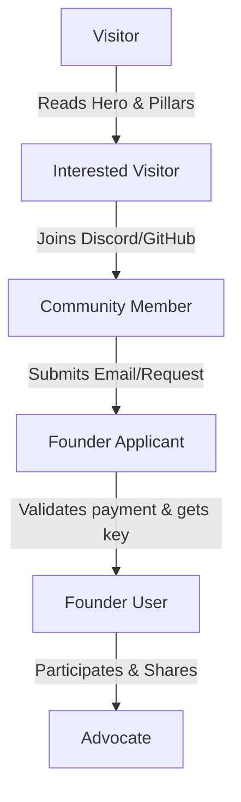

# CafePulse Revision 3.0: Founder Program Sales Funnel

This document outlines the conversion funnel to acquire and retain our target **100 Founder Users**.

---

## 1. Funnel Visualization & Journey Stages

---

## 2. Funnel Stage Analysis

### 2.1 Stage: Visitor ➔ Interested Visitor
- **Objective**: Hook attention within the first 15 seconds.
- **User Information Needed**: What the app does (local-first MikroTik operations), pricing model, and developer transparency.
- **Barriers**: Skepticism about security (closed-source app accessing Router OS).
- **Barriers Mitigation**: Display the offline security promise clearly, show screenshots, and provide the EULA/Privacy policy.

### 2.2 Stage: Interested Visitor ➔ Community Member
- **Objective**: Move the user to our Discord server or GitHub repository.
- **User Information Needed**: Live community support details, active feedback channels.
- **Barriers**: Reluctance to join another chat server.
- **Barriers Mitigation**: Offer a direct benefit (e.g. *"Interact directly with the developer to shape features"*).

### 2.3 Stage: Community Member ➔ Founder Applicant
- **Objective**: Convert interest into a purchase request.
- **User Information Needed**: Founder benefits (5-Year Professional license updates, badging, input on roadmap), limits (strictly capped at 100 slots).
- **Barriers**: Mismatch in currency (USD vs. IDR), payment friction.
- **Barriers Mitigation**: Provide simple local payment workflows (QRIS, DANA, GoPay) via direct email invoice templates.

### 2.4 Stage: Founder Applicant ➔ Founder User
- **Objective**: Validate payment, activate license key, and onboard.
- **User Information Needed**: Activation files, offline activation setup guides.
- **Barriers**: Network isolation prevents online activation check.
- **Barriers Mitigation**: Fully support the **Offline Activation workflow** (Generate request file ➔ Receive activation file).

### 2.5 Stage: Founder User ➔ Advocate
- **Objective**: Turn the early adopter into a community evangelist.
- **User Information Needed**: Developer updates, Discord founder-only channel access.
- **Barriers**: Lack of communication or slow updates.
- **Barriers Mitigation**: Send regular developer logs (weekly/bi-weekly updates) and respond to bug reports immediately.
